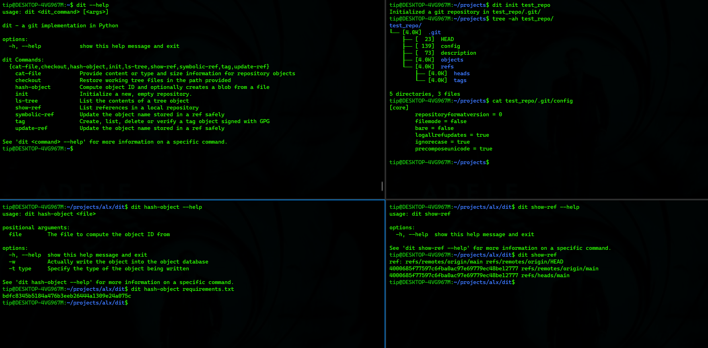

# dit - A Git implementation in Python



## Introduction
Dit is a Git implementation project that aims to provide a simplified version of the Git version control system. The implementation currently includes features such as repository creation, hashing objects, listing content of tree objects, showing and updating references, and more. It is designed to be a learning resource for understanding the underlying concepts and mechanics of Git.

### Author
David Tei - [LinkedIn](https://linkedin.com/in/david-tei-204a54b8)  [Github](https://github.com/davtei)

## Installation
### Prerequisites
* python3
* pip
* setuptools
* wheel

### How To Install dit
1. Clone the repository from github:
```sh
git clone https://github.com/davtei/dit.git
```

1. Change into the project directory:
```sh
cd dit/
```

3.Build the dit package:
```sh
python3 setup.py sdist bdist_wheel
```

4. Install the dit package with:
```sh
pip3 install dist/dit-0.1.tar.gz
```

### How To Uninstall dit
To uninstall the dit package from your system, run:
```sh
pip3 uninstall dit -y
```

## Usage
To display the help message for dit and its subcommands, run:
```sh
dit [-h]
dit <dit_command> [-h] [--help]
```

The implementations currently supported by this project include:
* `dit init`
  - initializes a new repository in path provide
    ```
    dit init path/to/repo
    ```

* `dit hash-object`
  - outputs how an object will be stored in the .git/objects directory:
    ```sh
    dit hash-object hello.txt
    ```

* `dit ls-tree`
  - outputs the content of a tree object
    ```sh
    dit ls-tree f99d9c136ab2ef4d0451fc9be9d7d224f7b3a586
    ```

* `dit show-ref`
  - show aliases to commit objects
    ```sh
    dit show-ref
    ```

* `dit update-ref`
  - updates a reference to a past commit
    ```sh
    cat .git/refs/heads/master
    eeacb2ae3f609f90b550d5fe7ea8259052257b35

    dit update-ref refs/heads/master 59260065988438f4451d1a78e708f5f731de7c7a

    cat .git/refs/heads/master
    59260065988438f4451d1a78e708f5f731de7c7a
    ```

## Contributing
As a work in progress, I welcome any contribution to the project.
You can contribute by:
* adding to implementations by forking and feature branches
* submitting bug fixes
* submitting descriptive pull requests of suggested changes

## Related Projects
Related projects that also provided a source of inspiration include:
* [codecrafters](https://app.codecrafters.io/courses/git)
* [ugit](https://www.leshenko.net/p/ugit)
* [wyag](https://wyag.thb.lt)

## Licensing
MIT License